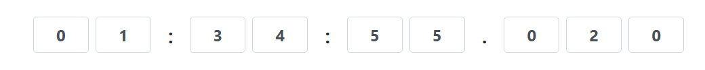
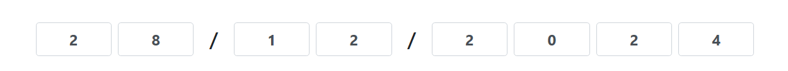
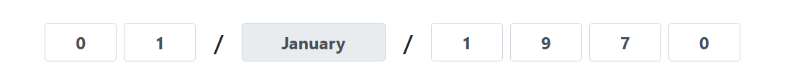
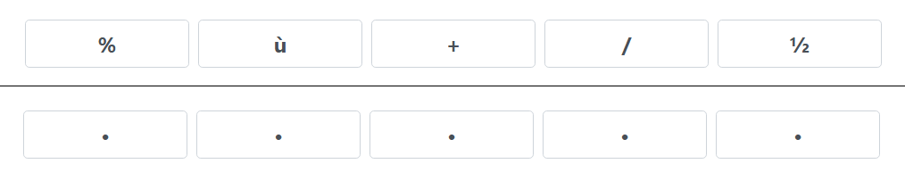

# CodeInputBuilder

**CodeInputBuilder** est un plugin JavaScript basé sur jQuery permettant de créer des champs de saisie numérique personnalisés.
Il supporte plusieurs options de configuration pour gérer les entiers, les nombres flottants, les textes et des interactions avancées.

## Table des matières
- [Fonctionnalités](#fonctionnalités)
- [Installation](#installation)
- [Utilisation](#utilisation)
- [Options](#options)
- [Exemples](#exemples)
- [Méthodes](#méthodes)
- [Accessibilité](#accessibilité)
- [Styles personnalisés](#styles-personnalisés)
- [Dépendances](#dépendances)
- [Tests Unitaires](#tests-unitaires)
- [Licence](#licence)

## Fonctionnalités

**CodeInputBuilder** propose une large gamme de fonctionnalités permettant une saisie numérique flexible et personnalisable. Voici les principales fonctionnalités disponibles :

- **Saisie de différents types de données** : Prend en charge `integer`, `float`, `binary`, `hexadecimal`, `letter`, `text` et `time`.
- **Configuration des limites min/max** : Chaque champ peut avoir des valeurs minimales et maximales spécifiques.
- **Option de signe (+/-)** : Permet d’ajouter un signe (positif ou négatif) pour chaque valeur.
- **Callback `onValueChange`** : Fonction personnalisée déclenchée à chaque changement de valeur.
- **Défilement pour ajuster les valeurs** : Permet d’ajuster les valeurs des champs en utilisant la molette de la souris, avec une sensibilité configurable (`scrollSensitivity`).
- **Requête de touche pour le défilement** : Une touche spécifique (`Control`, `Shift`, `Alt`, `Meta`) peut être requise pour activer la fonctionnalité de défilement (`requireKeyForScroll`), permettant un contrôle précis des valeurs.
- **Affichage des valeurs limites** : Visualisation des valeurs limites avec un effet de survol pour indiquer la plage autorisée à l’utilisateur.
- **Nombre d'entrées configurables** : Définit le nombre de champs de saisie (`numInputs`).
- **Espacement personnalisable entre les champs** : Permet de définir l’espace entre les champs d'input (`gap`).
- **Position de la virgule pour `float`** : Paramètre pour définir la position du séparateur décimal (`decimalPosition`).
- **Contrôle de validité des entrées** : Limite les caractères saisis en fonction des valeurs min/max et du type de données spécifié.
- **Accessibilité améliorée** : Intègre les attributs ARIA (`aria-valuemin`, `aria-valuemax`, `aria-valuenow`, `aria-live="polite"`) et le rôle `spinbutton` pour une expérience accessible aux utilisateurs de technologies d’assistance.
- **Descriptions et instructions** : Des messages d’aide sont intégrés pour guider les utilisateurs dans l’utilisation des champs, en particulier pour le défilement et l'ajustement des valeurs.
- **Gestion des copier-coller** : Restreint les valeurs saisies à un seul caractère, ce qui permet de conserver une saisie cohérente.
- **Activation et désactivation des champs** : Utilisation de l'option `isDisabled` pour désactiver les champs et empêcher les modifications si nécessaire.
- **Affichage et mise à jour des valeurs** : Utilisation des méthodes `setCompleteValue` et `getCompleteValue` pour définir et obtenir la valeur totale du champ d'input.
- **Manipulation fine des valeurs** : Grâce aux méthodes `getDigitAt` et `setDigitAt`, il est possible d’accéder et de modifier chaque chiffre individuel d’une valeur, offrant un contrôle granulaire.
- **Naviguer entre les champs**  : Utilisez `ArrowLeft` (flèche gauche) ou `Shift+Tab` pour passer au champ précédent et `ArrowRight` (flèche droite) ou `Tab` pour passer au champ suivant. 
- **Incrémenter ou décrémenter les valeurs** : Utilisez `ArrowUp` (flèche haut) pour augmenter une valeur et `ArrowDown` (flèche bas) pour diminuer une valeur.
- **Masquage des champs `maskInput`** : Permet de masquer les champs d'entrée en mode `password` pour garantir la confidentialité des saisies. Cette fonctionnalité peut être activée ou désactivée dynamiquement.
- **Destruction d'instance `destroy`**: Supprimez proprement une instance du plugin et restaurez l'élément d'origine.
- **Support des formats dynamiques**: Gère des champs de saisie personnalisés pour les heures, minutes, secondes et millisecondes grâce au type `time` et gère des champs de saisie personnalisés pour l'année, le mois, et le jour grâce au type `date`.  
  Exemple de formats pris en charge :  
  - `HH:MM:SS`  
  - `HH:MM:SS.SSS`  
  - Séparateurs dynamiques (`:`, `.`, `|`, etc.).
  Exemple de formats pris en charge :  
  - `DD/MM/YYYY` ou `DD/MH/YYYY`
  - `DD-MM`  
  - Séparateurs dynamiques (`/`, `-`, `|`, etc.).
- **Validation automatique dans le cas d'un type `time`**: Les champs sont automatiquement validés en fonction de leurs limites :  
  - Heures ≤ 23  
  - Minutes/Secondes ≤ 59  
  - Millisecondes ≤ 999  
- **Validation automatique dans le cas d'un type `date`**: Les champs sont automatiquement validés en fonction de leurs limites :  
  - 1 ≤ Jours ≤ [31,30,29,28] en fonction de l'année et du mois  
  - 1 ≤ Mois ≤ 12  
  - 1970 ≤ Année ≤ 9999  
- **Support des langues localisées pour les mois** : Grâce à l'option `defaultLanguage`, le plugin supporte les noms de mois localisés, en utilisant des langues compatibles avec `Intl.DateTimeFormat`.
- **Format des mois dynamiques (`MH`)** : Ajout du format `MH` pour afficher les mois sous leur nom complet dans la langue choisie (`Janvier`, `February`, etc.).

## Installation

1. Clonez le dépôt ou téléchargez les fichiers.
2. Assurez-vous d'inclure les fichiers CSS et JavaScript dans votre projet :
   ```html
   <link href="src/codeinputbuilder.css" rel="stylesheet">
   <script src="src/codeinputbuilder.js"></script>
   ```

## Utilisation

1. Intégrez un élément HTML pour le champ de saisie.
   ```html
   <div id="codeInputInteger"></div>
   ```
2. Initialisez le plugin avec jQuery :
   ```javascript
   $('#codeInputInteger').codeInputBuilder({
       type: 'integer',
       numInputs: 5,
       minValues: [0, 0, 0, 0, 0],
       maxValues: [9, 8, 7, 6, 5],
       allowSign: true,
       defaultSign: '+',
       gap: '1px',
       onValueChange: function($input, newValue) {
           console.log(`Input modifié : ${$input.attr('id')} - Nouvelle valeur : ${newValue}`);
       }
   });
   ```

## Options

| Option              | Type         | Description                                                                                      | Valeur par défaut |
|---------------------|-------------------|--------------------------------------------------------------------------------------------------|--------------------|
| `type`              | `string`         | Type de valeur (`integer`, `float`, `binary`, `hexadecimal`, `letter`, `text`,`time`,`date`).           | `integer`         |
| `numInputs`         | `integer`        | Nombre d'entrées/chiffres.                                                                       | `1`               |
| `minValues`         | `array`          | Valeurs minimales par position.                                                                  | `[]`              |
| `maxValues`         | `array`          | Valeurs maximales par position.                                                                  | `[]`              |
| `values`            | `array`          | Valeurs par défaut par position.                                                                 | `[]`              |
| `defaultValue`      | `Date|number|string`    | Valeur par défaut des champs. Dans le cas d'un time le format de l'heure à utiliser (par exemple : HH:MM:SS, HH:MM:SS.SSS, etc.) avec des séparateurs dynamiques (: ou ., etc.),Dans le cas d'un date le format de la date à utiliser (par exemple : DD/MM/YYYY, MM-DD-YYYY, etc.) avec des séparateurs dynamiques (/ ou -, etc.).                                                                  | `0`               |
| `gap`               | `string`         | Espace entre les champs d'entrée.                                                                | `'10px'`          |
| `allowSign`         | `boolean`        | Autorise l'ajout d'un signe (+/-).                                                               | `false`           |
| `defaultSign`       | `string`         | Signe par défaut (`+` ou `-`).                                                                   | `'+'`             |
| `decimalPosition`   | `integer`        | Position de la virgule pour les flottants.                                                       | `1`               |
| `separator`         | `string`         | Caractère de séparation pour les décimales (ex. `.`).                                            | `'.'`             |
| `totalMax`          | `float`          | Valeur maximale totale possible.                                                                 | `null`            |
| `totalMin`          | `float`          | Valeur minimale totale possible.                                                                 | `null`            |
| `allowScroll`       | `boolean`        | Active ou désactive la fonctionnalité de défilement.                                             | `true`            |
| `scrollSensitivity` | `integer`        | Définit la sensibilité du défilement.                                                            | `50`            |
| `requireKeyForScroll` | `string`       | Touche à enfoncer (par exemple 'Control' ou 'Shift') pour activer le défilement sur les inputs. Valeurs possibles : 'Control', 'Shift', 'Alt', 'Meta'. Sensible à la casse.  | `null`            |
| `autoFocusNextInput`| `boolean`        |  Active le décalage automatique du focus vers l'input suivant lors de la saisie.                 | `false`            |
| `autoFocusNextInputDirection`| `string`    |  Détermine la direction du décalage automatique du focus. Valeurs possibles : 'Forward', 'Right', 'Backward', 'Left'. Sensible à la casse.                                | `null`            |
| `onValueChange`     | `function`   | Fonction déclenchée lorsque la valeur change.                                                    | `null`            |
| `isDisabled`       | `boolean`        | Permet de désactiver les inputs. Si activé, les champs ne seront pas modifiables par l'utilisateur. Dans le cas d'un CodeInput de type "text" cette option n'est pas utilisable.                                             | `true`            |
| `allowArrowKeys`       | `boolean`        | Active ou désactive la fonctionnalité de navigation via les touches `ArrowLeft`,`ArrowRight`,`ArrowUp`,`ArrowDown`.                                             | `false`            |
| `maskInput`  | `boolean`  | Permet de masquer la saisie des champs par des * (utilisé comme mode mot de passe). | `false`           |
| `formatTime`  | `string`  | Format de l'heure à utiliser (par exemple : HH:MM:SS, HH:MM:SS.SSS, etc.) avec des séparateurs dynamiques (: ou ., etc.). | `HH:MM:SS`           |
| `formatDate` | `string` | Format de la date à utiliser (par exemple : DD/MM/YYYY, DD/MH/YYYY, MM-DD-YYYY, etc.) avec des séparateurs dynamiques (/ ou -, etc.). | `DD/MM/YYYY` |
| `defaultLanguage`   | `string`        | Définit la langue par défaut utilisée pour les mois ou autres formats liés à la localisation. La langue doit être compatible avec l’API `Intl.DateTimeFormat`. Valeurs possibles : `'fr'`, `'en'`, `'es'`, etc. | `'fr'` |


## Exemples

### Exemple pour un nombre entier


```javascript
$('#codeInputInteger').codeInputBuilder({
    type: 'integer',
    numInputs: 5,
    values: [0, 0, 0, 0, 0],
    minValues: [0, 0, 0, 0, 0],
    maxValues: [9, 8, 7, 6, 5],
    allowSign: true,
    defaultSign: '+',
    gap: '1px',
    requireKeyForScroll: 'Control',
    onValueChange: function($input, newValue) {
        console.log(`Valeur modifiée : ${newValue}`);
    }
});
```

### Exemple pour un nombre flottant


```javascript
$('#codeInputFloat').codeInputBuilder({
    type: 'float',
    numInputs: 7,
    values: [0, 0, 0, 0, 0, 0, 0],
    minValues: [0, 0, 0, 0, 0, 0, 0],
    maxValues: [9, 9, 9, 9, 9, 9, 9],
    decimalPosition: 3,
    gap: '10px',
    totalMax: 180.0,
    separator: ',',
    onValueChange: function($input, newValue) {
        console.log(`Valeur complète : ${newValue}`);
    }
});
```

### Exemple pour un texte


```javascript
$('#codeInputText').codeInputBuilder({
    type: 'text',
    values: ['Lorem', 'Consectetur', 'Eiusmod', 'Nulla', 'Vestibulum', 'Sollicitudin'], 
    defaultValue: 'Lorem',
    onValueChange: function($input, newValue) {
        console.log(`Valeur complète : ${newValue}`);
    }
});
```

### Exemple pour une heure



```javascript
$('#codeInputTime').codeInputBuilder({
    type: 'time',
    formatTime: 'HH:MM:SS.SSS', // Format valide
    defaultValue:new Date(Date.UTC(1970, 0, 1, 1, 34, 55, 20)), // Par défaut, l'heure actuelle
    gap: '10px', // Espace entre les inputs
    onValueChange: function($input, newValue) {
        // Affichage de la valeur modifiée
        console.log(`Valeur complète : ${newValue}`);
    }
});
```

### Exemple pour une date



```javascript
$('#codeInputTime').codeInputBuilder({
    type: 'date',
    formatDate: 'DD/MM/YYYY', // Format valide
    defaultValue:new Date(Date.UTC(2024, 11, 20, 0, 0, 0, 0)), // Par défaut, l'heure actuelle
    gap: '10px', // Espace entre les inputs
    onValueChange: function($input, newValue) {
        // Affichage de la valeur modifiée
        console.log(`Valeur complète : ${newValue}`);
    }
});
```

### Exemple pour une date avec le format MH



```javascript
$('#codeInputDate').codeInputBuilder({
    type: 'date',
    formatDate: 'DD/MH/YYYY', // Affiche le mois sous son nom complet
    defaultLanguage: 'en', // Définit la langue en anglais
    defaultValue: new Date(Date.UTC(1970, 1, 1)), // 1 janvier 1970
    gap: '10px', // Espace entre les inputs
    onValueChange: function($input, newValue) {
        console.log(`Valeur complète : ${newValue}`);
    }
});
```

### Exemple pour un password



```javascript
$('#codeInputTime').codeInputBuilder({
    type: 'letter',
    numInputs: 5,
    values: ['%', 'ù', '+', '/', '½'],
    minValues: [0x00, 0x00, 0x00, 0x00, 0x00],
    maxValues: [0xff, 0xff, 0xff, 0xff, 0xff],
    maskInput: true,
    gap: '10px', // Espace entre les inputs
    onValueChange: function($input, newValue) {
        // Affichage de la valeur modifiée
        console.log(`Valeur complète : ${newValue}`);
    }
});
```

## Méthodes

Le plugin `Code Input Builder` offre plusieurs méthodes pour interagir avec et manipuler les champs d'input. Voici une description de chaque méthode disponible :

- ### `getDigitAt(index)`
    - **Description** : Récupère la valeur d'un chiffre spécifique à un index donné dans le champ d'input.
    - **Paramètre** : 
      - `index` (integer) : L'index du chiffre à récupérer.
    - **Retour** : La valeur du chiffre à l'index spécifié.
    - **Exemple** :
      ```javascript
      $('#element').codeInputBuilder().getDigitAt(2);
      ```

- ### `setDigitAt(index, value)`
    - **Description** : Définit la valeur d'un chiffre spécifique à un index donné dans le champ d'input.
    - **Paramètres** :
      - `index` (integer) : L'index du chiffre à définir.
      - `value` (integer/string) : La nouvelle valeur à définir pour ce chiffre.
    - **Exemple** :
      ```javascript
      $('#element').codeInputBuilder().setDigitAt(2, 5);
      ```

- ### `getCompleteValue()`
    - **Description** : Récupère la valeur complète saisie dans l'input, en prenant en compte tous les chiffres.
    - **Retour** : La valeur complète sous forme de nombre ou de chaîne de caractères, en fonction du type d'input configuré.
    - **Exemple** :
      ```javascript
      const fullValue = $('#element').codeInputBuilder().getCompleteValue();
      ```

- ### `setCompleteValue(value, onchange = false)`
    - **Description** : Définit la valeur complète dans l'input. Cette méthode prend en compte tous les chiffres et met à jour l'input.
    - **Paramètres** :
      - `value` (integer/string) : La valeur complète à définir.
      - `onchange` (boolean, optionnel) : Si défini sur `true`, déclenche le callback `onValueChange` après la mise à jour de la valeur. Par défaut `false`.
    - **Exemple** :
      ```javascript
      $('#element').codeInputBuilder().setCompleteValue("1234", true);
      ```

- ### `toggleInputs(disabled)`
    - **Description** : Active ou désactive tous les champs d'input du plugin.
    - **Paramètre** :
      - `disabled` (boolean) : Si `true`, désactive les inputs ; si `false`, les active.
    - **Exemple** :
      ```javascript
      $('#element').codeInputBuilder().toggleInputs(true); // Désactive tous les inputs
      ```

- ### `changeMaskInputs(isPassword)`
    - **Description** : Permet de basculer dynamiquement entre l'affichage des champs en mode texte ou en mode masqué (type `password`).
    - **Paramètre** :
      - `isPassword` (boolean) : Si `true`, les champs sont masqués (type `password`). Si `false`, ils redeviennent des champs texte.
    - **Exemple** :
      ```javascript
      const instance = $('#codeInputTime').codeInputBuilder();
      instance.destroy(); // Supprime l'instance et restaure l'élément d'origine
      ```

- ### `destroy()`
    - **Description** : Supprime l'instance actuelle du plugin et restaure l'élément d'origine.
    - **Exemple** :
      ```javascript
      const instance = $('#codeInputTime').codeInputBuilder({
        type: 'time',
        formatTime: 'HH:MM:SS',
        maskInput: false
      });
      // Activer ou désactiver dynamiquement le mode masqué
      instance.changeMaskInputs(true); // Masquer les champs
      instance.changeMaskInputs(false); // Afficher les champs
      ```

Ces méthodes permettent de contrôler et manipuler les valeurs des champs d'input générés par le plugin, offrant une grande flexibilité et une intégration aisée dans des applications interactives.

### Notes importantes sur l'option `defaultLanguage`

- La langue par défaut est `'fr'` (français).
- Les langues doivent être compatibles avec l’API `Intl.DateTimeFormat`. Si une langue non valide est spécifiée, une erreur sera levée.
- Les noms des mois affichés dans le format `MH` sont automatiquement traduits en fonction de la langue choisie. Exemple : `'Janvier'` en français, `'January'` en anglais, `'Enero'` en espagnol.
- Le format `MH` ne peut être utilisé que dans les options de type `date`.

## Accessibilité

Ce plugin a été conçu pour être accessible aux utilisateurs de lecteurs d'écran et inclut plusieurs améliorations pour une meilleure prise en charge de l'accessibilité :

- **Attributs ARIA** : Les attributs `aria-valuemin`, `aria-valuemax`, et `aria-valuenow` sont utilisés pour indiquer les limites minimales, maximales et la valeur actuelle de chaque champ d'input.
- **Annonces dynamiques** : `aria-live="polite"` permet de notifier les changements de valeur aux utilisateurs de lecteurs d'écran de manière non intrusive, pour une meilleure compréhension des modifications en temps réel.
- **Rôle `spinbutton`** : Les éléments d'input sont marqués avec le rôle `spinbutton`, ce qui indique aux technologies d'assistance qu'ils sont ajustables, pour une meilleure expérience de navigation.
- **Instructions claires** : Des descriptions et instructions sont intégrées dans les attributs ARIA pour guider l'utilisateur dans l'utilisation des champs de saisie, notamment pour la saisie et l’ajustement de valeurs.

## Styles personnalisés

Le fichier CSS `codeinputbuilder.css` personnalise l'apparence des champs :
- `.cla-h2-like` : Applique une apparence similaire à un titre `<h2>`.
- `.cla-hover-text` : Style les textes de survol pour les valeurs limites.

## Dépendances

- [jQuery](https://jquery.com) (3.5.1+)
- [Bootstrap](https://getbootstrap.com) (4.5.2+)

## Tests Unitaires

Le projet inclut des tests unitaires pour garantir le bon fonctionnement du plugin `CodeInputBuilder`. Ces tests couvrent plusieurs aspects clés du plugin :

- **Vérification des options** : Assure que toutes les options de configuration, comme `type`, `numInputs`, `minValues`, `maxValues`, et autres, sont valides et se comportent comme prévu. Des erreurs sont levées si des valeurs incorrectes sont fournies.
- **Gestion des types** : Teste le comportement du plugin pour différents types de valeurs (`integer`, `float`, `text`, etc.), en vérifiant les spécificités de chaque type, comme les positions décimales pour `float` ou les limitations pour `integer`.
- **Génération dynamique des éléments DOM** : Vérifie que les éléments HTML (inputs, labels, conteneurs) sont correctement générés avec les attributs, classes et identifiants adéquats, même avec des parties d'ID générées aléatoirement.
- **Accessibilité** : Valide que chaque élément a les attributs ARIA appropriés pour garantir une bonne accessibilité.
- **Callbacks et interactivité** : Teste le déclenchement de certains événements, comme `onValueChange`, et l’interaction avec des fonctionnalités dynamiques (par exemple, la gestion des signes, les limites de valeurs).
- Les tests couvrent l’utilisation de l’option `defaultLanguage` pour vérifier la compatibilité des langues et le rendu correct des noms de mois en fonction de la langue choisie.
- Des cas spécifiques pour le format `MH` sont inclus pour s’assurer que les noms de mois sont traduits correctement.


### Exécution des tests

Les tests sont configurés avec [Karma](https://karma-runner.github.io/), [Mocha](https://mochajs.org/), et [Chai](https://www.chaijs.com/) pour une exécution facile et rapide. Les tests sont exécutés dans un environnement de navigateur simulé avec Chrome en mode headless.

Pour exécuter les tests en local, suivez ces étapes :

1. Assurez-vous d’avoir toutes les dépendances installées :

  ```bash
  npm install
  ```

2. Lancez les tests :

  ```bash
  npm test
  ```
  
### Intégration continue

Les tests unitaires sont également exécutés automatiquement dans un environnement d'intégration continue (CI) via [GitHub Actions](https://docs.github.com/en/actions). Chaque push et pull request déclenche le workflow CI, qui exécute les tests dans un environnement standardisé. En cas de succès, les tests garantissent que les modifications du code respectent les spécifications du plugin.

### Couverture des tests
Les tests actuels couvrent :

- Les options et leur validation
- Les types de valeurs (integer, float, text, etc.)
- La génération d'éléments HTML (inputs et labels) dans le DOM
- Les attributs d'accessibilité ARIA
- Les fonctionnalités de callback et l'interaction utilisateur

Ces tests permettent d'assurer la stabilité et la fiabilité du plugin, et de détecter les régressions potentielles lors des mises à jour.

## Licence

Distribué sous la licence MIT. Consultez `LICENSE` pour plus d’informations.
